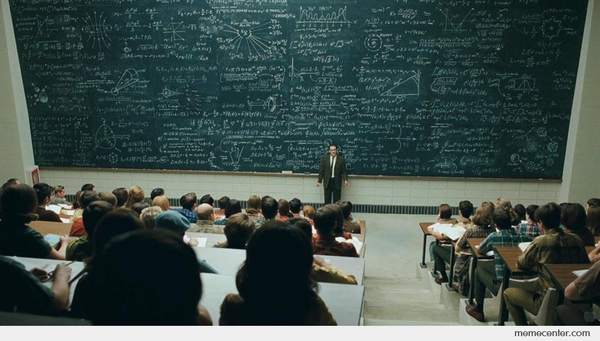

# Getting the Code to Fit (Specifically, Getting Javascript ES6 Code to Fit an ESLint Coding Standard)

## Section

Here is a placeholder image.

Image credit: https://www.memecenter.com/fun/91630/huge-blackboard

## Section

## Section

